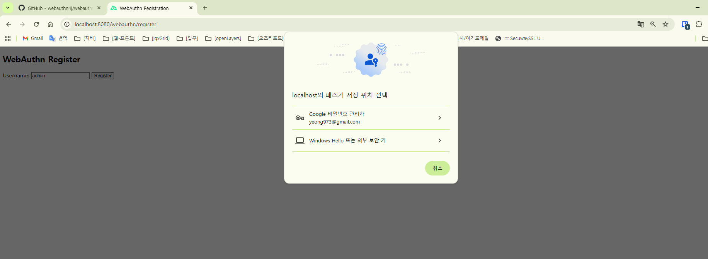
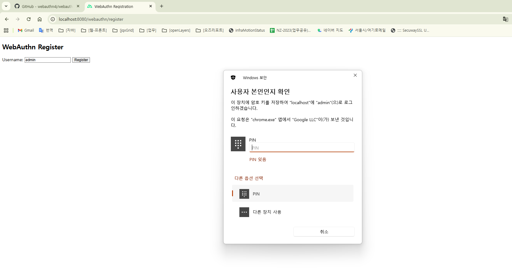

# 테이블 세팅하기
1. webauthn에 필요한 메타 데이터 테이블 만들기(형태나 기본키 설정 등)
2. 등록 테스트하기

# 단계
1) 10/17 ~ : webAuthn 입문
 - webAuthn 적용할 라이브러리 찾기

2) 10/20 ~ 22: 1차 예제 적용
 - webAuthn4j, Yubico 라이브러리 둘다 적용

| 항목           | WebAuthn4J                                                                       | Yubico java-webauthn-server                                                                    |
| ------------ | -------------------------------------------------------------------------------- | ---------------------------------------------------------------------------------------------- |
| 개발사 / 커뮤니티   | 오픈소스 커뮤니티 기반 — 예: Keycloak, SpringSecurity와 연계됨. ([libhunt.com][1])              | Yubico에서 공식 제공하는 Java 라이브러리. ([developers.yubico.com][2])                                      |
| 기능 범위        | FIDO2 / WebAuthn 검증 기능 충실히 지원 — 다양한 attestation 형식 지원. ([libhunt.com][1])        | WebAuthn 서버쪽 검증 기능 제공 (“Relying Party operations”) — 등록/인증 흐름 지원. ([developers.yubico.com][3]) |
| 문서 / 예제      | 문서가 있지만 버전별로 변화가 크고, 일부 구조가 복잡하다는 평 있음. ([corbado.com][4])                       | 공식 문서와 데모 서버까지 갖춰져 있어 진입장벽이 낮음. ([developers.yubico.com][2])                                   |
| 스프링 부트 연동    | SpringSecurity와 연계된 모듈도 있음 (“webauthn4j-spring-security”). 다만 버전/배포 이슈가 있을 수 있음. | 스프링 연동 예제가 있지만, 보통 Core 기능만 사용하고 보안 구성은 별도 구현해야 함.                                             |
| 커스터마이징       | 고수준에서 유연성이 높음 — 직접 CredentialRepository 구현 등 개발자 제어가 많음.                         | 검증 기능은 확고하고 안정적이지만, 저장소/비즈니스 흐름은 개발자가 구현해야 함.                                                  |
| 안정성 / 배포 편의성 | 버전 호환성이나 배포시 이슈가 보고된 경우 있음 (특히 Spring Boot 최신 버전과 같이).                           | 안정성이 더 높다는 평가가 많음. ([developers.yubico.com][2])                                                |
| 추천 상황        | WebAuthn을 깊이 커스터마이징하거나 SpringSecurity와 밀접하게 통합하고 싶을 때                            | 빠르게 검증 기능만 확보하고, 저장소나 흐름은 직접 설계하고 싶은 경우                                                        |

3) 10/23 ~ 24 : 2차 예제 적용
  - 다시 webAuthn4j로 하기로 하고, 예제들 찾아서 적용
  - 실패가 많아서 수정
    - 1. primarymapperscan 경로 이상하게 지정함("com.example.*.store"가 일반적인데 repository를 만들겠다고 "com.example.*.repository"로 잘못 지정함)

5) 10/27 ~ : 2차 예제 수정 중..

  - 실패: Registration failed!
 
