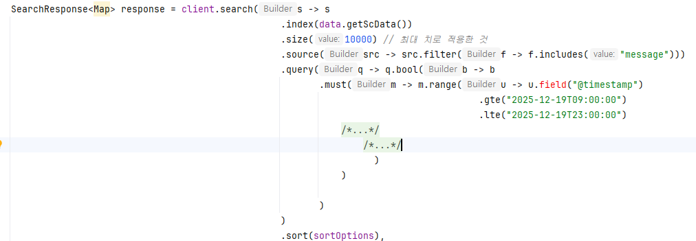
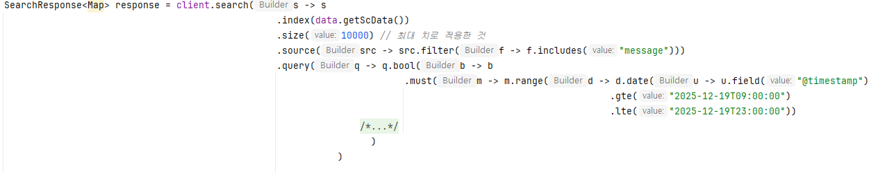
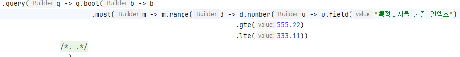
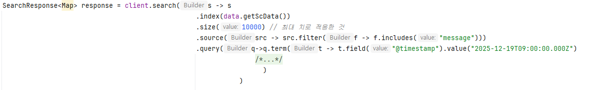
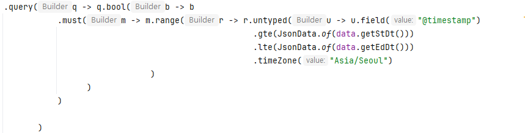

# Elasticsearch 정리

## 1. 사용 배경
- 대용량 로그 검색 및 필터링 필요
- 시간 범위 + 키워드 + ID 조합 검색

## 2. 사용 기술
- Elasticsearch 9.2.0
- Spring Data Elasticsearch
- NativeQuery
- FetchSourceFilter
- Kibana

## 3. 설계 / 구조
- index mapping 구조
- @timestamp 기반 range query
- message 필드 text / keyword 분리

## 4. 주요 쿼리 예제

## 시간 범위 및 아이디 검색
```
"must":[
    {
      "match": {
                "terminal_id": "idv948002007"
            }
    },
    {
      "range": {
        "@timestamp": {
          "gte": "2025-12-19T09:00:00",
          "lte": "2025-12-19T23:00:00"
        }
      }
    }
]
```

## 5. 문제 및 해결

### 5-1. range 사용 시, range의 쿼리에서 field를 직접 사용을 못함
 원인: range 쿼리에서 바로 field를 지정하고 날짜 범위를 지정 시, range쿼리의 속성으로 인해 field 메서드가 에러가 남
    range는 엄격한 타입의 메서드이기 때문에 날짜 범위의 타입을 지정해야함. 
    * 날짜 타입 : term, date, number


※ 타입

|메서드|설명|"값의 타입 (gte, lte에 들어갈 값)"|
|--|--|--|
|.date()|날짜 비교 시 사용|"String (ISO8601)| Long (Epoch), Date 객체 등"|
|.number()|실수/정수 비교 시 사용|Double|
|.long_()|정수(Long) 비교 시 사용|Long (Java에서는 long_()으로 정의됨)|
|.term()|문자열 범위 비교 시 사용|String (사전순 비교)|
|.untyped()|타입 미지정 (범용)|JsonData|
 
해결: 4번 방법을 썼지만 다양한 방법에 대해서는 아래를 보면 알 수 있다.  
 1. 타입 지정(date)


 2. 특정 숫자 데이터를 가진 거라면(number)
    - 제공되는 타입은 Double


 3. term은 범위의 개념이 아닌 특정 날짜의 개념이라 지정일을 명시해야 한다.
    - 아래 표는 일반적인 term과 range에서의 term을 나타냄
      
    
 |구분|range 쿼리의 .term()|일반 term 쿼리|
|--|--|--|
|핵심 성격|범위(Range)|일치(Match)|
|비교 방식|사전순/문자열 기준 범위 비교|정확한 값 매칭|
|사용 예시|A ~ C 사이의 문자열 찾기|특정 ID나 정확한 날짜 1개 찾기|

 4. 타입 미지정(untyped)
    - 타입에 상관없이 모든 타입을 허용하는 쿼리
    

```
# 에러사항
 - 해결 에러 사항
 java.lang.IllegalArgumentException: Illegal base64 character 2e
  해결점: implementation 'com.fasterxml.jackson.datatype:jackson-datatype-jsr310'
```

 ## 6. 배운점
엘라스틱 서치라는 대용량 데이터를 