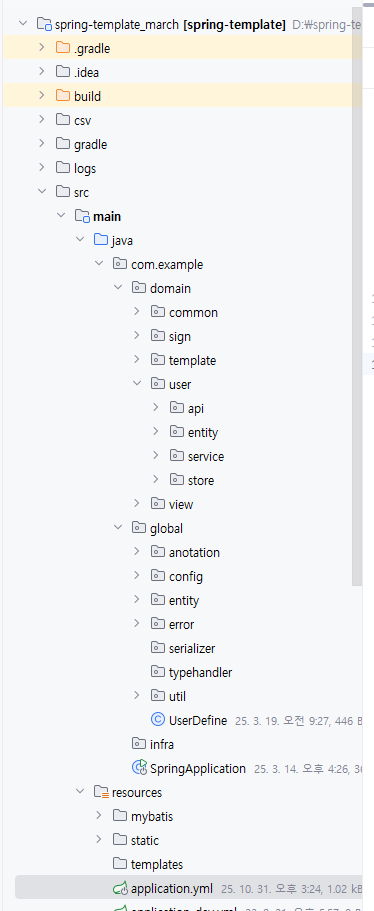
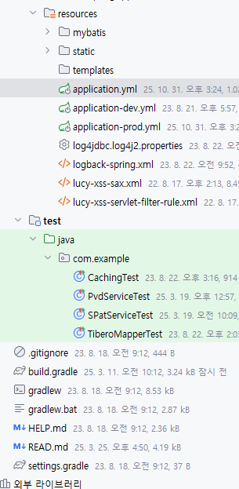

application.yml
```java
### server info ###
server:
  port: 8080

spring:
  profiles:
    active: dev
  devtools:
    livereload:
      enabled: false
  ### datasource config ###
  datasource:
    primary:
      driver-class-name: net.sf.log4jdbc.sql.jdbcapi.DriverSpy
      jdbc-url: jdbc:log4jdbc:tibero:thin:@(DESCRIPTION=(failover=on)(load_balance=on)(address_list=(address=(host=~~)(port=~~))(address=(host=~~)(port=~~)))(database_name=~~))
      username: ~~
      password: '~~'
    secondary:
      driver-class-name: net.sf.log4jdbc.sql.jdbcapi.DriverSpy
      jdbc-url: jdbc:log4jdbc:impala:
  messages:
    basename: messages/messages
    encoding: UTF-8
  servlet:
    multipart:
      file-size-threshold: 2MB
      location: ./temp
      max-file-size: 50MB
      max-request-size: 200MB
  jackson:
    date-format: yyyy-MM-dd'T'HH:mm:ss
    time-zone: Asia/Seoul

### mybatis config ###

### springdoc ###

### Application config ###
```



```bash
파일 트리
main > java > com.example(자유) > domain > common(예시) > api > commonapiResource
                                                      > entity > results, params > ...
                                                      > service > commonservice > class인데 @Transactional, @Slf4j, @RequiredArgsConstructor, @Service
                                                      > store > commonMapperStore (interface)
                               > global > anotation, config, entity(enums넣기 가능), error, userDefine(file), util,,, 
     > resources > mybatis > mappers > tibero , impala > ~.xml
                           > mybatis-config.xml
                 > static  > error, images           

```