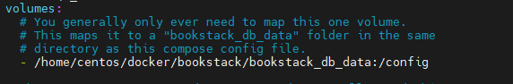
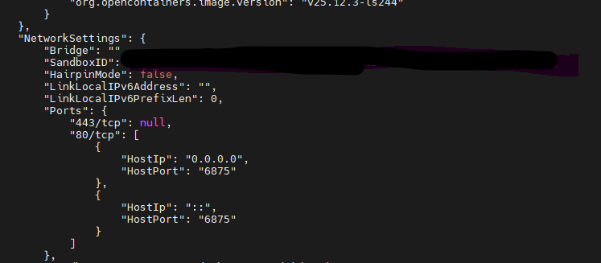

# docker 사용 정리
1. 이미지 볼륨 경로 -> 절대경로로 할 것(상대경로가 아닌) : 처음에는 root 계정에서 바로 프로젝트 아래로 넣었음
   - 도커의 볼륨(volume)은 컨테이너가 삭제될 때 재시작 되어도 그 안의 데이터를 영구적으로 보관할 수 있는 저장소 /
            여러 컨테이너 간에 쉽게 공유, 백업 가능 /
            도커가 관리해서 안전
   



2. inspect 컨테이너 : 컨테이너 상세 정보 확인 - ip, 이미지 등 상세 정보
명령어: docker inspect bookstack(북 스택 이용시)


3. compose : compose란, docker_app_data, docker_db_data, docker-compose.yml(이것도 포함)의 내용을 한번에 실행시키고자 할 때 사용되는 명령 집합
    - 기존에는 아래 예시와 같이, 위치, 포트, 환경 설정을 한 것을 한 줄로 실행시켜 각각 프로그램 별로 설정함(이는 수정 어려움, 여러 컨테이너 연결이 복잡)
```
// nifi 예시
docker run -d \
  --name nifi \
  -p 8080:8080 \
  -v /home/user/nifi:/opt/nifi/nifi-current/data \
  -e NIFI_WEB_HTTP_PORT=8080 \
  apache/nifi:latest   

```
```
// yml 예시
version: "3"
services:
  nifi:
    image: apache/nifi:latest
    ports:
      - "8080:8080"
    volumes:
      - /home/user/nifi:/opt/nifi/nifi-current/data
    environment:
      - NIFI_WEB_HTTP_PORT=8080
```
위와 같은 방법으로 yml이 만들어지면 docker compose up -d 를 하면 업데이트가 되는 형식으로 발전

4. 명령어 정리

| 명령어                                                        |명령 내용                   |
|-------------------------------------------------------------|-----------------------|
| docker compose down (docker compose down –v(볼륨 삭제 초기화))     | 도커 중지                 |
| docker compose up –d                                        | 도커 시작 (yml등 수정하고 재시작) |
| docker compose logs "컨테이너" --tail=30                       | 도커 로그 30중만 보기         |
| docker-compose exec "컨테이너" yarn db:migrate --env=production | 도커 셧다운                |
| docker-compose up -d --force-recreate | 기존 캐시 무시하고 다시 올리기     |
| docker-compose down --volumes --remove-orphans | 컨테이너와 네트워크 싹 밀기    |
| docker-compose exec outline yarn db:migrate --env=production | 컨테이너 안에서 yarn으로 DB 마이그레이션을 production 환경으로 실행     |
| docker-compose run --rm outline yarn db:migrate --env=production | outline 컨테이너를 새로 임시 실행해서 DB 마이그레이션 돌리고 끝나면 컨테이너 삭제   |

 - exec : 이미 있는 곳에 들어가 작업
 - run : 새로운 곳을 만들고 작업
